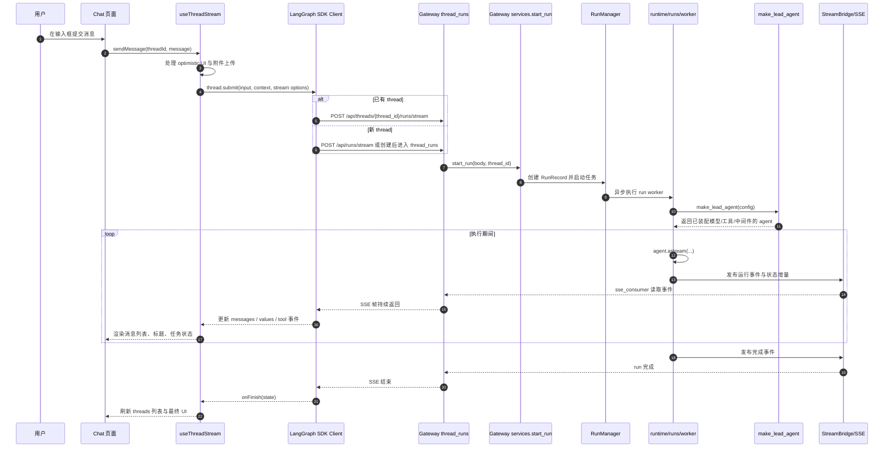
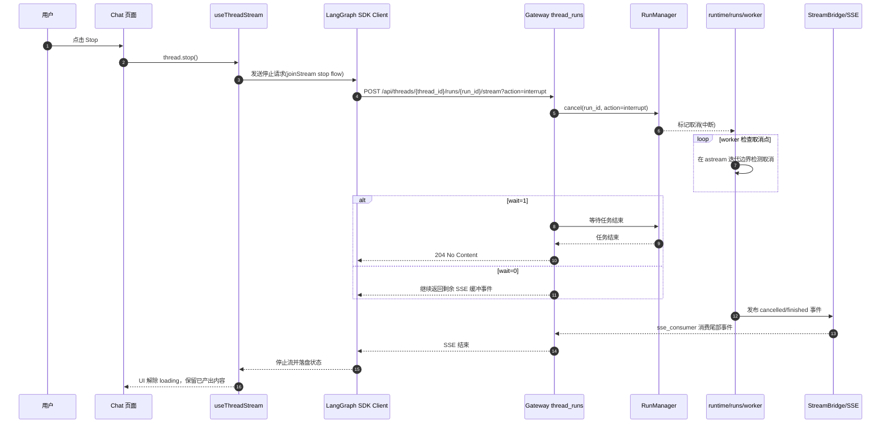
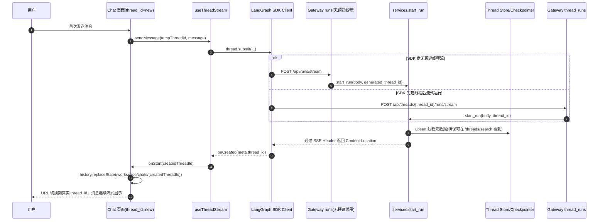

# DeerFlow Chat 实现说明与时序图

## 目标

本文整理 DeerFlow Chat 在前后端的关键实现位置，以及从用户发送消息到流式返回的完整时序。

适用场景：

- 快速理解聊天功能主链路
- 排查流式返回、停止按钮、新会话建链问题
- 新同学入门代码导航

## 关键代码位置

### 前端

- 聊天页面入口：frontend/src/app/workspace/chats/[thread_id]/page.tsx
- 流式会话与发送逻辑：frontend/src/core/threads/hooks.ts
- API Client 封装：frontend/src/core/api/index.ts
- API Client 具体实现：frontend/src/core/api/api-client.ts

### 后端 Gateway

- 路由挂载入口：backend/app/gateway/app.py
- 线程运行路由：backend/app/gateway/routers/thread_runs.py
- 无预建线程运行路由：backend/app/gateway/routers/runs.py
- 运行服务层：backend/app/gateway/services.py

### 后端 Runtime 与 Agent

- Run Worker：backend/packages/harness/deerflow/runtime/runs/worker.py
- Lead Agent 构建：backend/packages/harness/deerflow/agents/lead_agent/agent.py

## 总览：聊天主链路

## 分支一：停止按钮 Stop 流程

## 分支二：新会话创建流程

## 前端到后端的参数要点

- 前端 sendMessage 会把模式信息写入 context：thinking_enabled、is_plan_mode、subagent_enabled、reasoning_effort。
- thread.submit 使用 streamSubgraphs 与 streamResumable，支持更完整的流式事件和断线恢复。
- 后端通过 Content-Location 返回 run 资源路径，供 SDK 识别与续流。

## 排查建议

- 页面无流式更新：先看 thread_runs 路由是否收到请求，再看 services 的 SSE consumer。
- Stop 不生效：检查 /runs/{run_id}/stream?action=interrupt 是否命中，以及 RunManager.cancel 返回状态。
- 新会话 URL 不切换：检查 onCreated 回调是否触发与 history.replaceState 是否执行。

## 一句话总结

DeerFlow Chat 是一个基于 LangGraph SDK + Gateway SSE 的流式对话链路：前端 useThreadStream 发起 run，后端 Run Worker 驱动 agent.astream，事件经 StreamBridge 回传，最终在前端增量渲染为聊天界面。